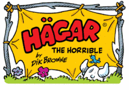

# hagar

Hagar is a modern bluetooth manager for Linux written in Rust.

## About

Hagar is named for the titular character of the comic Hagar the Horrible by Dik Browne.

## Logo Attribution

<a href="https://www.flaticon.com/free-icons/viking" title="viking icons">Viking icons created by Freepik - Flaticon</a>
